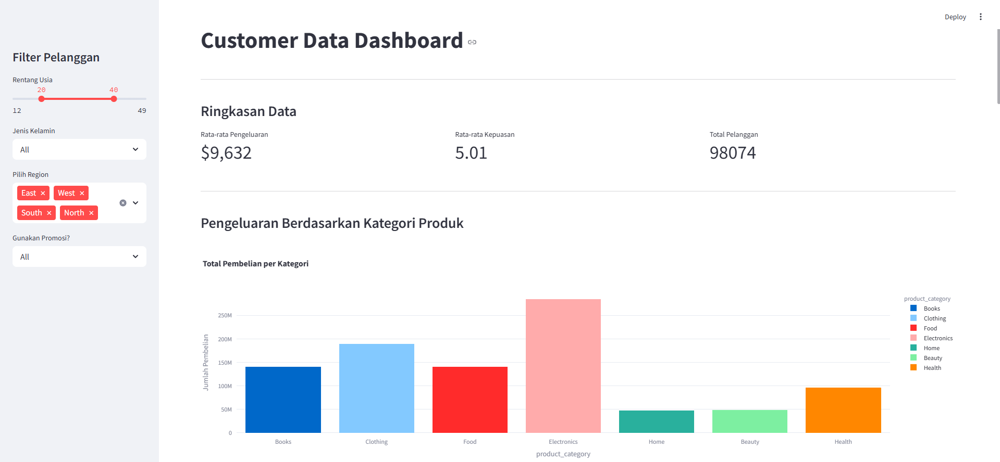

# Customer Purchase Behavior Dashboard

This repository presents an **interactive Streamlit dashboard** designed to analyze and visualize customer purchase behavior. The dashboard offers users the ability to explore various aspects of customer data, including spending patterns, satisfaction levels, and purchase trends.

## Project Overview

This project aims to provide a comprehensive analysis of customer behavior through an interactive dashboard. Users can filter data based on age, gender, region, and promotion usage, and explore various visualizations to identify patterns in customer purchasing decisions. Key insights include product category spending, satisfaction distribution, loyalty status, and the impact of promotions on purchase behavior.

## Dashboard Preview

Here is a preview of the dashboard visuals you will interact with:

This will give you an idea of the key visualizations you will explore, such as customer spending behavior, satisfaction scores, and the impact of promotions.

---

### Dashboard Features:
- **Interactive Filters**: 
  - Filter by **Age**, **Gender**, **Region**, and **Promotion Usage**
- **Visualizations**:
  - Various charts to display insights like spending by product category, customer distribution by region, and satisfaction levels
  - Analysis of the impact of promotion usage on purchase frequency
- **Data Summary**:  
  - Display key metrics such as **Average Spending**, **Average Satisfaction**, and **Total Customers**  
  - Option to **view raw data** for deeper exploration

## Key Metrics Displayed

- **Spending by Product Category**  
- **Satisfaction Distribution**  
- **Customer Distribution by Region**  
- **Average Spending by Loyalty Status**  
- **Promotion Impact on Purchase Frequency**  
- **Average Purchase Amount**  
- **Average Satisfaction Score**  
- **Total Number of Customers**

## Data Source

The dataset used in this dashboard is sourced from Kaggle:  
[Customer Purchases Behavior Dataset](https://www.kaggle.com/datasets/sanyamgoyal401/customer-purchases-behaviour-dataset)

However, the dataset has already been uploaded to **Google Drive**. **You do not need to download the dataset manually**. The application will automatically access the dataset from the drive when you run the app.

---

With this dashboard, users can filter data based on various customer attributes and explore different visualizations to gain insights into **customer spending**, **satisfaction**, **loyalty status**, **promotion impact**, and more. The dashboard also allows users to view the **raw data** for further analysis.
